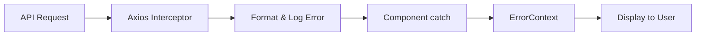

# Employee Management System - Frontend

## 🚀 Quick Start

1. Create Vite project:
```bash
npm create vite@latest
```

2. Install dependencies:
```bash
npm install bootstrap axios react-router-dom
```

3. Configure port in `vite.config.js`:
```javascript
export default {
  server: {
    port: 3000
  }
}
```

## 📦 Dependencies

- **Bootstrap**: UI styling and components
- **Axios**: HTTP client for API calls
- **React Router**: Navigation and routing

## 🏗️ Project Architecture

### Core Components
1. `App.jsx`: Main application component
2. `ListAllEmployee.jsx`: Displays employee table
3. `AddEmployee.jsx`: Employee creation form
4. `ErrorContext.jsx`: Global error handling

### Request Flow


## 🔄 How React Works

1. **Initial Load**
   - Browser requests page
   - Server returns `index.html`
   - `main.jsx` executes
   - React mounts to `<div id="root">`

2. **Continuous Operation**
   - Browser event loop keeps JS running
   - React manages state and updates
   - React Router handles navigation
   - Components re-render as needed

## 🛠️ Development Setup

1. Clone repository
2. Install dependencies:
```bash
npm install
```

3. Start development server:
```bash
npm run dev
```

4. Open browser:
```
http://localhost:3000
```

## 📁 Project Structure

```
EMS-Frontend/
├── src/
│   ├── components/
│   │   ├── ListAllEmployee.jsx
│   │   ├── AddEmployee.jsx
│   │   └── EditEmployee.jsx
│   ├── context/
│   │   └── ErrorContext.jsx
│   ├── services/
│   │   └── EmployeeService.js
│   ├── App.jsx
│   └── main.jsx
└── vite.config.js
```

## ✨ Features

- List all employees
- Add new employee
- Edit existing employee
- Delete employee
- Global error handling
- Responsive design
- Form validation

## 🔗 API Integration

- Backend API endpoint: `http://localhost:8080/api/employees`
- Axios interceptors for error handling
- RESTful API conventions